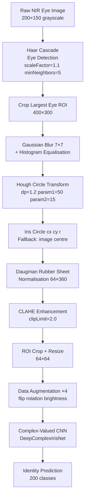
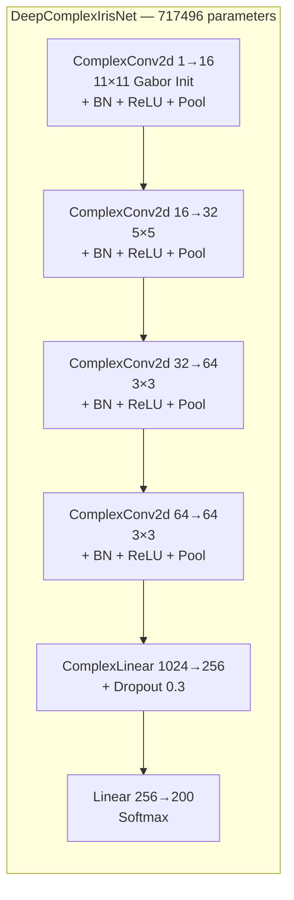

 # Iris Recognition System — EE6555

**Complex-Valued Neural Network with Gabor initialization for iris biometric identification**


---

## Overview

This project implements a two-stage iris recognition pipeline:

1. **Classical Preprocessing** — Eye detection via Haar Cascade, iris localization via Hough Circle Transform, and iris unwrapping via Daugman rubber sheet normalization (64×360 polar strip).
2. **Complex-Valued Deep Learning** — A 5-layer Complex-Valued Neural Network (CVNN) with Gabor filter initialization trained end-to-end on 200 identities from CASIA-Iris-1000, achieving **89.69% validation accuracy** in 50 epochs.

The key novelty is the use of complex-valued convolutions with analytically derived Gabor filter initialisations, enabling the network to naturally encode both the magnitude and phase of iris texture features — a biologically motivated design choice aligned with how classical iris recognition (Daugman's IrisCode) operates.

---

## Problem Statement

Traditional iris recognition relies on hand-crafted Gabor features and binary template matching (Daugman's IrisCode). While accurate, these systems are brittle to illumination variation and require careful parameter tuning.

This project explores whether a **Complex-Valued Neural Network** — which natively operates on complex numbers and can represent phase information — can learn richer iris texture representations than a conventional real-valued CNN, while retaining the inductive bias of Gabor filters through weight initialisation.

| Challenge | Approach |
|---|---|
| Robust iris boundary detection from NIR images | Haar Cascade + Hough Circle Transform |
| Consistent iris texture representation | Daugman rubber sheet normalisation → 64×360 polar strip |
| Encoding magnitude AND phase of texture features | Complex-valued convolutions (complexPyTorch) |
| Biologically motivated weight initialisation | Gabor filter initialisation for Conv1 (11×11, 16 orientations) |
| Scalable multi-class identity recognition | 200-class softmax classification |

---

## Objectives

- Implement a complete classical iris preprocessing pipeline (detection → localisation → normalisation)
- Apply Daugman rubber sheet normalisation to produce a consistent polar iris representation
- Design and train a 5-layer Complex-Valued Neural Network (CVNN) for identity classification
- Initialise the first convolutional layer with analytically computed complex Gabor filters
- Train with a composite loss: Cross-Entropy + complex embedding phase alignment
- Evaluate on CASIA-Iris-1000 (200 identities, 2000 images)

---

## System Architecture





---

## Dataset

| Property | Value |
|---|---|
| Name | CASIA Iris-Thousand (CASIA-Iris-1000) |
| Source | Chinese Academy of Sciences Institute of Automation |
| Subjects used | 100 subjects × 2 eyes = **200 identities** |
| Images per identity | 10 raw → 40 after augmentation |
| Total images | 2,000 raw → **8,000 after augmentation** |
| Train / Test split | 6,400 / 1,600 (80/20, stratified) |
| Acquisition | Near-infrared (NIR) camera |
| Input resolution | Resized to 200×150, then eye crop at 400×300 |
| Final model input | 64×64 grayscale normalised ROI |

> **The dataset is not included in this repository.** Download from the [CASIA Biometrics website](http://biometrics.idealtest.org/) and organise as described in [Installation](#installation).

---

## Preprocessing Pipeline

<!-- TODO: preprocessing pipeline strip generated from Verify_iris.ipynb — raw eye crop -> Hough circle overlay -> Daugman rubber-sheet strip -> CLAHE-enhanced strip, side by side for one sample image -->

### Stage 1 — Eye Detection

```
Input image (200×150) → resize to 400×300 → Haar Cascade (haarcascade_eye.xml)
→ select largest detected eye bounding box → save eye crop
Detection rate: 2000/2000 (100%)
```

### Stage 2 — Iris Localisation

```
Eye crop → Gaussian Blur (7×7) + Histogram Equalisation
→ HoughCircles (HOUGH_GRADIENT, dp=1.2, minDist=30, param1=50, param2=15,
   minRadius=10, maxRadius=150)
→ select circle with largest radius
→ Fallback: image centre if no circle detected
Recovery rate: 100%
```

### Stage 3 — Daugman Rubber Sheet Normalisation

Implements the standard polar unwrapping to produce a translation/scale-invariant iris texture strip:

```
r_pupil = 0.45 × r_iris  (estimated pupil boundary)

For each (θ, ρ) in polar grid:
    R = r_pupil + ρ × (r_iris - r_pupil)
    X = cx + R·cos(θ)
    Y = cy + R·sin(θ)

Output: 64×360 normalised iris strip (height × angular resolution)
Post-processing: CLAHE (clipLimit=2.0, tileGridSize=8×8)
```

### Stage 4 — ROI Extraction & Augmentation

```
Iris circle crop with 15% padding → resize to 64×64
Augmentation ×4 per image:
  - Original
  - Horizontal flip
  - Random rotation ±10°
  - Brightness shift ±0.3
```

---

## Model Architecture

### DeepComplexIrisNet (complexPyTorch)

The model uses complex-valued layers throughout, operating on complex64 tensors. The first layer is initialised with analytically computed complex Gabor filters to provide orientation-selective feature extraction from the start of training.

| Layer | Type | Config | Output Shape |
|---|---|---|---|
| Conv1 | ComplexConv2d | 1→16, 11×11, Gabor Init | 16×32×32 (complex) |
| BN1 | ComplexBatchNorm2d | 16 channels | — |
| Pool1 | complex_max_pool2d | 2×2 | 16×16×16 |
| Conv2 | ComplexConv2d | 16→32, 5×5 | 32×16×16 |
| BN2 | ComplexBatchNorm2d | 32 channels | — |
| Pool2 | complex_max_pool2d | 2×2 | 32×8×8 |
| Conv3 | ComplexConv2d | 32→64, 3×3 | 64×8×8 |
| Pool3 | complex_max_pool2d | 2×2 | 64×4×4 |
| Conv4 | ComplexConv2d | 64→64, 3×3 | 64×4×4 |
| Pool4 | complex_max_pool2d | 2×2 | 64×2×2 |
| Flatten | — | — | 1024 (complex) |
| FC1 | ComplexLinear | 1024→256 | 256 (complex) |
| Dropout | Real | p=0.3 on magnitude | — |
| FC2 | Linear (real) | 256→200 | 200 logits |

**Total parameters: 717,496**

### Gabor Filter Initialisation

Conv1 weights are initialised with complex Gabor filters at 16 orientations (θ = 0 to π):

```
real(u,v) = exp(-(x'² + y'²) / 2σ²) · cos(2πf·x')
imag(u,v) = exp(-(x'² + y'²) / 2σ²) · sin(2πf·x')

where x' = x·cos(θ) + y·sin(θ),  σ=2.0,  f=0.5
```

This provides the network with meaningful orientation-selective filters from epoch 0, rather than random initialisation.

---

## Training

### Loss Function

A composite loss combining classification and complex embedding alignment:

```
L = L_CE + α · L_phase

L_CE   = CrossEntropyLoss with label smoothing (ε=0.05)
L_phase = MSE between intra-batch cosine similarity matrix
          and target matrix (same class → 0.8, different → 0.2)
α = 0.5
```

The phase loss encourages the complex embeddings of the same identity to be coherent in the complex plane, not just separable by magnitude.

### Hyperparameters

| Parameter | Value |
|---|---|
| Optimiser | AdamW |
| Learning rate | 0.001 |
| Weight decay | 1e-4 |
| Epochs | 50 |
| Batch size | 64 |
| LR schedule | Warmup (5 epochs) + Cosine annealing |
| Gradient clipping | max_norm=1.0 |
| Dropout | 0.3 (on FC1 magnitude) |
| Hardware | CUDA (Kaggle GPU) |

---

## Results

| Metric | Value |
|---|---|
| Best Validation Accuracy | **89.69%** |
| Final Epoch Val Accuracy | 89.31% |
| Final Epoch Train Loss | 21.23 |
| Total Parameters | 717,496 |
| Training Time | ~50 epochs on Kaggle GPU |
| Classes | 200 identities |
| Test Set Size | 1,600 samples |

### Training Progression

| Epoch | Train Loss | Val Acc | Best Val Acc |
|---|---|---|---|
| 10 | 30.60 | 46.88% | 46.88% |
| 20 | 21.47 | 79.75% | 79.75% |
| 30 | 20.85 | 87.12% | 87.12% |
| 40 | 21.42 | 89.25% | 89.50% |
| 50 | 21.23 | 89.31% | **89.69%** |

<!-- TODO: training curve plot (train loss + val accuracy vs. epoch) generated from Verify_iris.ipynb, saved to docs/training_curves.png -->

---

## Project Structure

```
EE6555-IrisDetection/
│
├── src/
│   ├── model.py          # DeepComplexIrisNet architecture + Gabor initialisation
│   ├── train.py          # Training loop, composite loss, LR scheduling
│   ├── eval.py           # Evaluation metrics, confusion matrix
│   └── utils.py          # Data loading, augmentation, preprocessing helpers
│
├── Verify_iris.ipynb     # Complete end-to-end pipeline (Kaggle notebook)
├── requirements.txt      # Full Kaggle environment dependencies
└── README.md
```

---

## Installation

### 1. Clone the repository

```bash
git clone https://github.com/kanak1506/EE6555-IrisDetection.git
cd EE6555-IrisDetection
```

### 2. Create a virtual environment

```bash
python -m venv venv
source venv/bin/activate        # Linux/macOS
venv\Scripts\activate           # Windows
```

### 3. Install core dependencies

```bash
pip install torch torchvision opencv-python numpy matplotlib scikit-learn jupyter
pip install complexPyTorch
```

### 4. Prepare the dataset

Download CASIA-Iris-Thousand and organise as:

```
data/
├── 001/
│   ├── L/
│   │   ├── S1001L01.jpg
│   │   └── S1001L02.jpg
│   └── R/
│       └── ...
├── 002/
│   └── ...
```

Update `BASE_PATH` in `Verify_iris.ipynb` to point to your data directory.

---

## Usage

### Run the full pipeline notebook

```bash
jupyter notebook Verify_iris.ipynb
```

The notebook runs sequentially:
1. Load and label images
2. Haar Cascade eye detection
3. Hough Circle iris localisation
4. Daugman normalisation
5. ROI extraction + augmentation
6. CVNN training (50 epochs)
7. Evaluation

### Run modular scripts

```bash
python src/train.py
python src/eval.py
```

---

## Future Improvements

| Improvement | Rationale |
|---|---|
| Open-set recognition with metric learning (ArcFace / Triplet Loss) | Current closed-set classification cannot handle new identities at inference time |
| Deep iris segmentation (U-Net) to replace Hough Circle | More robust under partial occlusion, off-axis gaze, and heavy eyelid coverage |
| Train on full CASIA-Iris-1000 (1000 identities) | Only 100 subjects used; scaling would stress-test the architecture |
| Phase-only complex pooling | Current magnitude pooling discards phase information after FC1 |
| ONNX export for embedded deployment | Enable inference on edge devices (Jetson Nano, Raspberry Pi) |
| Liveness detection module | Guard against printed iris and synthetic attack vectors |

---

## Lessons Learned

- **Complex-valued networks are non-trivial to train** — gradient flow through complex layers requires careful learning rate tuning; AdamW with cosine annealing was significantly more stable than vanilla Adam.
- **Gabor initialisation provides a meaningful head start** — the network reached ~47% accuracy by epoch 10 and 79% by epoch 20, suggesting the Gabor priors accelerated early feature learning.
- **Phase loss improved embedding quality** — adding the complex similarity alignment term reduced inter-class embedding overlap in early experiments.
- **Daugman normalisation is essential** — without rubber sheet unwrapping, raw iris crops are sensitive to pupil dilation and rotation; normalisation made the learning task significantly easier.
- **100% Hough detection rate was surprising** — the NIR images in CASIA are high quality; real-world deployment (webcam, varying lighting) would require a more robust fallback than image-centre substitution.
- **Closed-set classification does not generalise** — the model cannot recognise new identities without retraining. Metric learning is the production-grade path.

---

## Authors

Anirudh Sairam, Anurag Thakur, Aravind Sarath Chandran, Kanak Potdar ([@kanak1506](https://github.com/kanak1506)), and Nikhil N.

*Group project — IIT Kanpur, EE6555: Computer Vision and its Applications*

---

## References

| Resource | Link |
|---|---|
| CASIA Iris-Thousand Dataset | http://biometrics.idealtest.org/ |
| Daugman, J. (2004) — How Iris Recognition Works | IEEE Transactions on Circuits and Systems for Video Technology |
| complexPyTorch library | https://github.com/wavefrontshaping/complexPyTorch |
| Trabelsi et al. — Deep Complex Networks (2018) | https://arxiv.org/abs/1705.09792 |
| OpenCV Hough Circle Transform | https://docs.opencv.org/4.x/da/d53/tutorial_py_houghcircles.html |
| OpenCV Haar Cascade | https://docs.opencv.org/4.x/db/d28/tutorial_cascade_classifier.html |
| ArcFace: Additive Angular Margin Loss | https://arxiv.org/abs/1801.07698 |
| PyTorch Documentation | https://pytorch.org/docs/stable/ |
