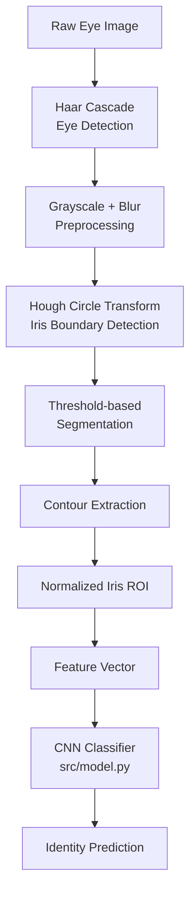
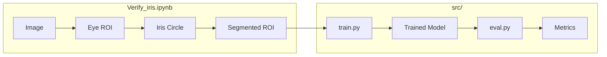

# Iris Recognition System — EE6555

**End-to-end iris biometric pipeline: classical localization + deep learning classification**


<!-- Replace with an actual banner/GIF showing the detection pipeline -->


---

## Overview

This project implements a two-stage iris recognition system:

1. **Detection & Preprocessing** — Eye region localization via Haar Cascade, iris boundary detection via Hough Circle Transform, threshold-based segmentation, and normalized ROI extraction.
2. **Recognition** — A CNN trained end-to-end on CASIA-Iris-1000 to classify iris images by identity (multi-class classification).

The full preprocessing pipeline is documented in `Verify_iris.ipynb`. The training and evaluation codebase lives in `src/`.

---

## Problem Statement

Iris recognition is one of the most reliable biometric modalities due to the high uniqueness and stability of iris texture patterns. Traditional systems depend on hand-engineered features (e.g., Gabor filters, Daugman's IrisCode) and template matching, which are brittle to illumination changes and difficult to scale.

This project addresses two challenges:

| Challenge | Approach |
|---|---|
| Robust iris localization from raw eye images | Classical CV: Haar Cascade + Hough Circle |
| Scalable identity recognition | End-to-end CNN classification |

**Beneficiaries:** Access control systems, border security, mobile authentication, research benchmarking.

---

## Objectives

- Implement a complete iris preprocessing pipeline using classical computer vision
- Localize and segment the iris region from raw eye images
- Extract a normalized iris ROI suitable for downstream learning
- Train a CNN to perform identity classification on CASIA-Iris-1000
- Evaluate recognition accuracy on a held-out test set

---

## System Architecture





---

## Pipeline Details

### Stage 1 — Detection & Preprocessing

| Step | Method | Tool |
|---|---|---|
| Eye region localization | Haar Cascade classifier | OpenCV |
| Iris boundary detection | Hough Circle Transform | OpenCV `HoughCircles` |
| Segmentation | Adaptive thresholding | OpenCV |
| ROI normalization | Contour extraction + crop/resize | OpenCV + NumPy |
| Feature export | Pickle serialization | Python `pickle` |

### Stage 2 — CNN Classification

| Component | Detail |
|---|---|
| Architecture | Custom CNN (`src/model.py`) |
| Input | Normalized iris ROI |
| Output | Softmax over N identity classes |
| Loss | Cross-Entropy |
| Optimizer | Adam |
| Training | Mini-batch, multi-epoch (`src/train.py`) |
| Evaluation | Accuracy, Confusion Matrix (`src/eval.py`) |

---

## Dataset

| Property | Value |
|---|---|
| Name | CASIA Iris-Thousand (CASIA-Iris-1000) |
| Source | Chinese Academy of Sciences |
| Subjects | 1,000 |
| Images per Subject | ~20 |
| Total Images | ~20,000 |
| Format | JPEG / BMP |
| Acquisition | Near-infrared (NIR) camera |

> **The dataset is not included in this repository.** Download it from the [CASIA Biometrics website](http://biometrics.idealtest.org/) and organize as described in [Installation](#installation).

---

## Project Structure

```
EE6555-IrisDetection/
│
├── src/
│   ├── model.py          # CNN architecture definition
│   ├── train.py          # Training loop, loss, optimizer
│   ├── eval.py           # Evaluation metrics, confusion matrix
│   └── utils.py          # Data loading, augmentation, helpers
│
├── Verify_iris.ipynb     # End-to-end pipeline demo notebook
├── requirements.txt      # Python dependencies
└── README.md
```

---

## Software Design

### `src/model.py`
Defines the CNN architecture. Convolutional blocks extract spatial iris texture features; fully connected layers map to identity class probabilities.

### `src/train.py`
Loads preprocessed iris ROIs, initializes the model, runs the training loop with Cross-Entropy loss and Adam optimizer, and saves checkpoints.

### `src/eval.py`
Loads a trained checkpoint and evaluates it on the held-out test set. Outputs accuracy, per-class metrics, and a confusion matrix.

### `src/utils.py`
Handles dataset loading from the class-labeled directory structure, train/test splitting, image normalization, and batch preparation.

### `Verify_iris.ipynb`
Demonstrates the full classical preprocessing pipeline step-by-step:
- Haar Cascade eye detection
- Hough Circle iris localization
- Segmentation and contour extraction
- ROI normalization
- Feature export via pickle

---

## Results

> Results are from evaluation on the CASIA-Iris-1000 held-out test split.

| Metric | Value |
|---|---|
| Test Accuracy | _TODO: fill after run_ |
| Top-5 Accuracy | _TODO_ |
| Loss (final epoch) | _TODO_ |

<!-- Add confusion matrix image here -->


<!-- Add accuracy/loss curve here -->


---

## Installation

### 1. Clone the repository

```bash
git clone https://github.com/kanak1506/EE6555-IrisDetection.git
cd EE6555-IrisDetection
```

### 2. Create a virtual environment

```bash
python -m venv venv
source venv/bin/activate        # Linux/macOS
venv\Scripts\activate           # Windows
```

### 3. Install dependencies

```bash
pip install opencv-python torch torchvision numpy matplotlib scikit-learn jupyter
```

> `requirements.txt` contains the full Kaggle environment snapshot. For local use, the above packages are sufficient.

### 4. Prepare the dataset

Download CASIA-Iris-1000 and organize as follows:

```
data/
├── class_0001/
│   ├── S1001L01.jpg
│   └── S1001L02.jpg
├── class_0002/
│   └── ...
```

Each subdirectory corresponds to one identity.

---

## Usage

### Run the preprocessing notebook

```bash
jupyter notebook Verify_iris.ipynb
```

### Train the model

```bash
python src/train.py --data_dir data/ --epochs 30 --batch_size 32
```

### Evaluate

```bash
python src/eval.py --data_dir data/ --checkpoint checkpoints/best_model.pth
```

---

## Future Improvements

| Improvement | Rationale |
|---|---|
| Replace Hough Circle with deep iris segmentation (U-Net) | More robust under occlusion and off-axis gaze |
| Daugman's rubber sheet normalization | Standard polar unwrapping improves texture consistency |
| Metric learning (ArcFace / Triplet Loss) | Enables open-set recognition beyond fixed training classes |
| Data augmentation (rotation, noise, brightness) | Improves generalization to real-world acquisition conditions |
| ONNX export for embedded deployment | Edge deployment on embedded vision systems |
| Liveness detection module | Defends against printed/synthetic iris attacks |

---

## Lessons Learned

- **Hough Circle sensitivity** — The `HoughCircles` parameters (min/max radius, accumulator threshold) require careful tuning per dataset; values that work for CASIA NIR images do not generalize to RGB webcam images.
- **Classification vs. Verification** — Framing recognition as classification is simple to implement and train, but does not scale to new identities at inference time. Metric learning is the production-grade alternative.
- **Preprocessing dominates accuracy** — Most recognition errors originated from poor ROI normalization, not the classifier. Clean segmentation is the most impactful component.
- **Data organization matters** — Structuring data into class-labeled directories from the start made `ImageFolder`-style loading trivial and avoided preprocessing bugs.

---

## Authors

| Name | GitHub |
|---|---|
| Anirudh Sairam | — |
| Anurag Thakur | — |
| Aravind Sarath Chandran | — |
| Kanak Potdar | [@kanak1506](https://github.com/kanak1506) |
| Nikhil N | — |

*IIT Kanpur — EE6555: Computer Vision and its Applications*

---

## References

| Resource | Link |
|---|---|
| CASIA Iris-Thousand Dataset | http://biometrics.idealtest.org/ |
| Daugman, J. (2004) — How Iris Recognition Works | IEEE TIFS |
| OpenCV Hough Circle Transform | https://docs.opencv.org/4.x/da/d53/tutorial_py_houghcircles.html |
| OpenCV Haar Cascade | https://docs.opencv.org/4.x/db/d28/tutorial_cascade_classifier.html |
| ArcFace: Additive Angular Margin Loss | https://arxiv.org/abs/1801.07698 |
| PyTorch Documentation | https://pytorch.org/docs/stable/ |


